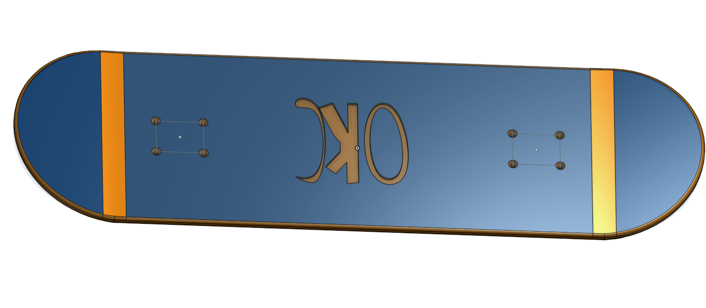
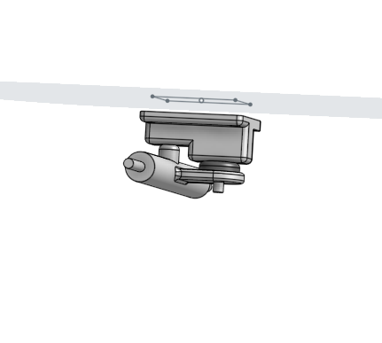
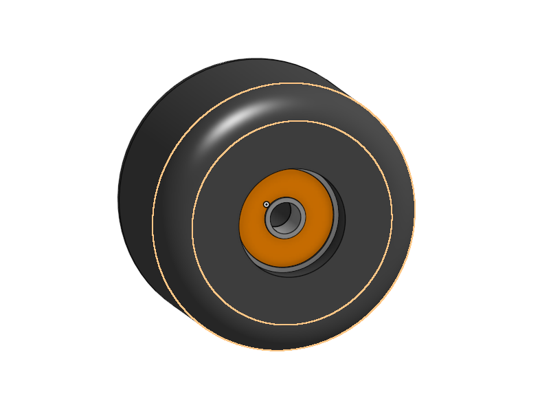
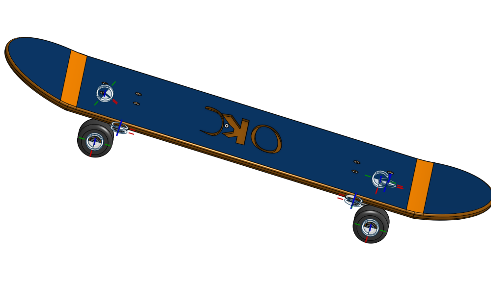
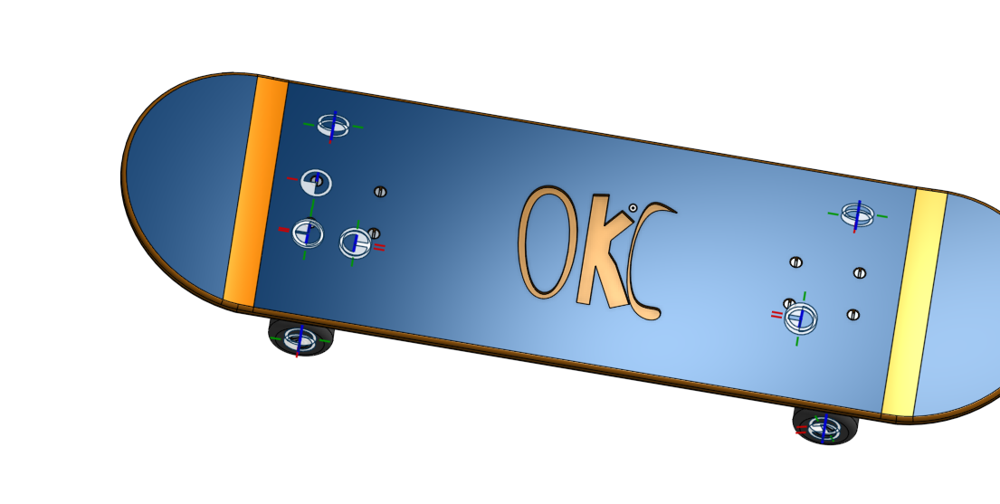
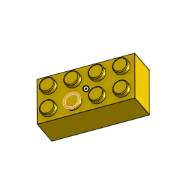
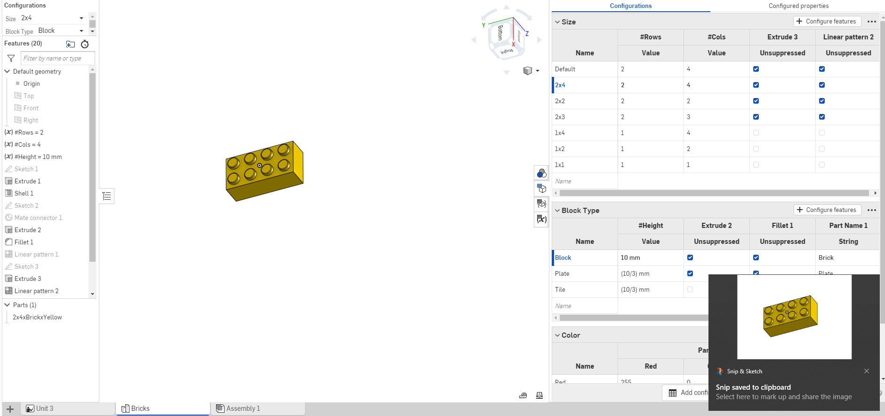
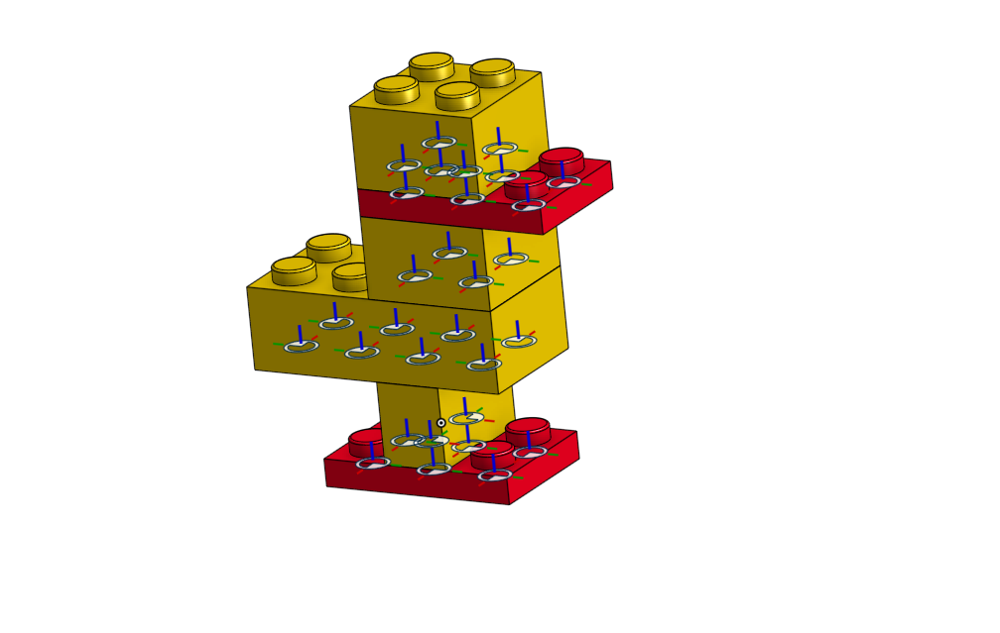
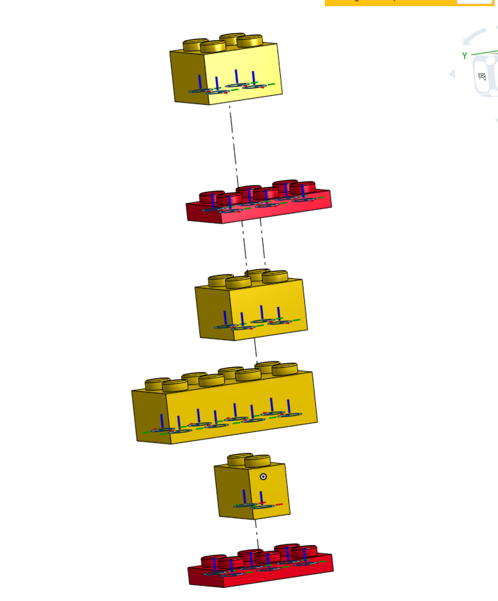

# Onshape-2021-2022

 ## 2.1-2.5 Skateboard

### Description
 This was the first part of the skateboard design and it was very easy to complete

### Evidence

Deck 

Trucks  

Wheels and bearings 

Assembly 

Let It shred (Bend the Board and inscribe Logo)  
 
### Reflection
The part I struggled the most on when designing the skateboard was the wheels and bearings. When I would deimensions the starting shape to be revolved it would go below the centerline you draw first. This messes up the revolve so to fix this make sure your whole shape is above the centerline before revolving.

Another thing that wasn't neccesary that I did was insert each nut and bolt into assembly indivudaly, when you could just make a pattern to do them all at once.
 
 ## 3.1 How the pros do it.
 

### Description
This assingment was to build a 2x4 lego brick using variables so you are able to make configurations later on.

### Evidence
 
 
 This image shows the 2x4 brick.
 
 ### Reflection
 
 I struggled with the linear pattern because I wasnt selected the right edge to pattern it along. You have to select the edge of the brick parallel to the pattern you want to make.
 
 ## 3.2 One brick to rule them all
 

### Description
 
 The assingment was to build a brick that could change using configurations to make the simple brick changlable into different shapes, rows/coloumns, and colors.

### Evidence
 
 
 
 This image shows the configurations and the brick that is changed by those configurations
 
 ### Reflection
 
 I struggled with this assingment because when I would do a brick with 1 column, the bottom connector piece would stick out in a wierd way. You can fix this by deleting the linear pattern for the configurations with 1 coloumn.
 
 
  ## 3.3 Putting it all toghether.
 

### Description
This assingment was to put some of the bricks together to make a lego duck using the snap tool.

### Evidence
 
 
 This image shows the constructed duck along with the mate. connectors
 
 ### Reflection
 
 When using the snap tool only some of the mate connectors would show, so I couldn't make the neccesary connections. To fix this I had to go back to the original skethc of the brick and turn on all of the mate connectors.
 
## 3.4 Drawing
 

### Description
This assingment was to make a detailed drawing of the duck assembly.

### Evidence
 
 This shows the completed drawing of the duck
 
 ### Reflection
 
 I didn't know how to explode the duck at first, the problem was I wasn't seperating them apart correctly, I was connecting them when seperating them, You have to drag each piece apart sepereately.
